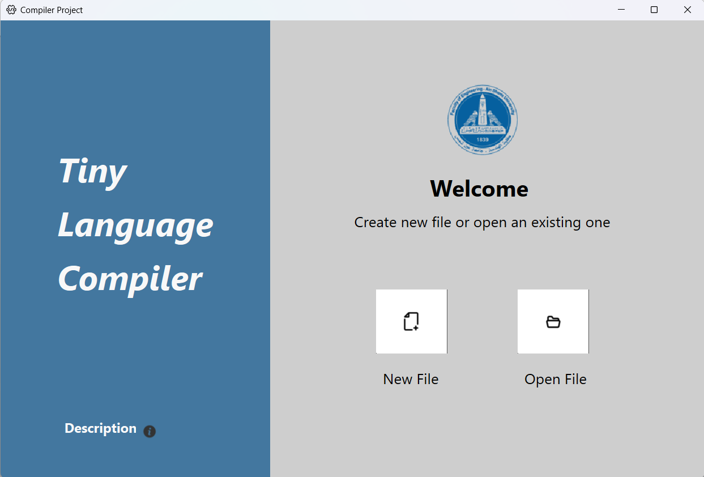
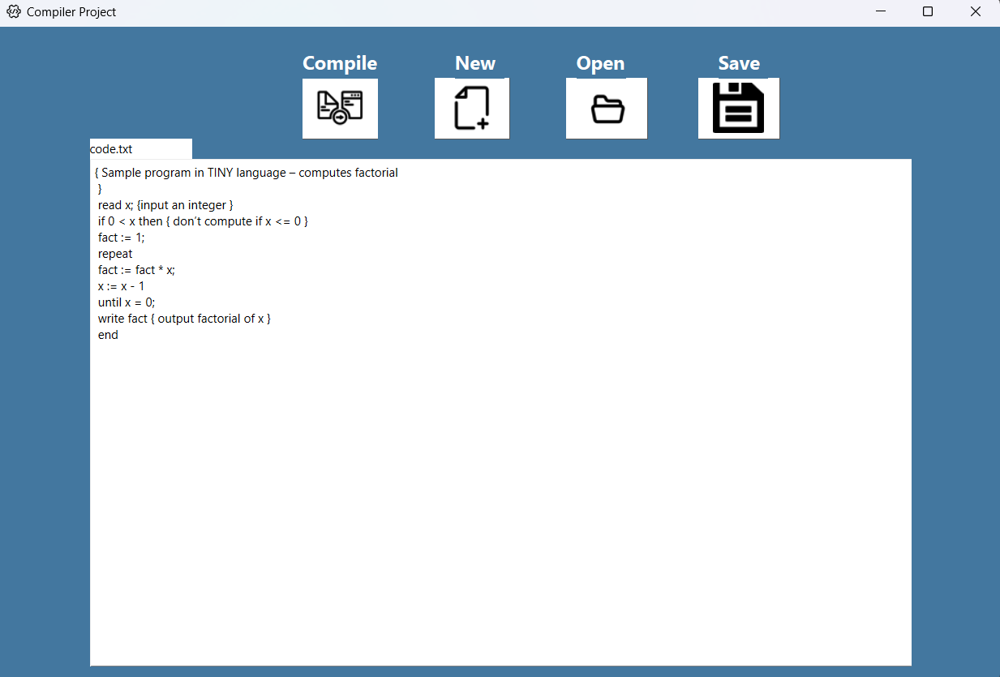
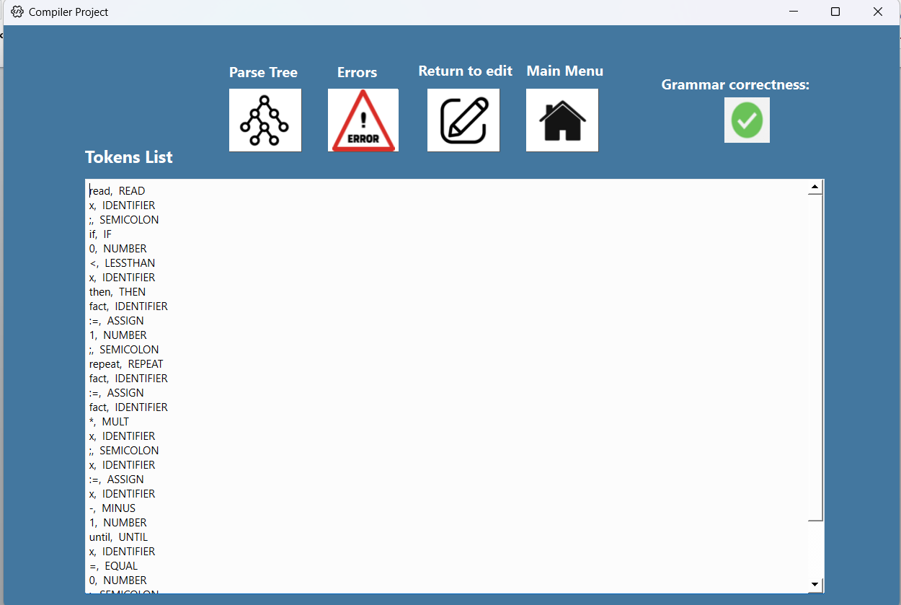
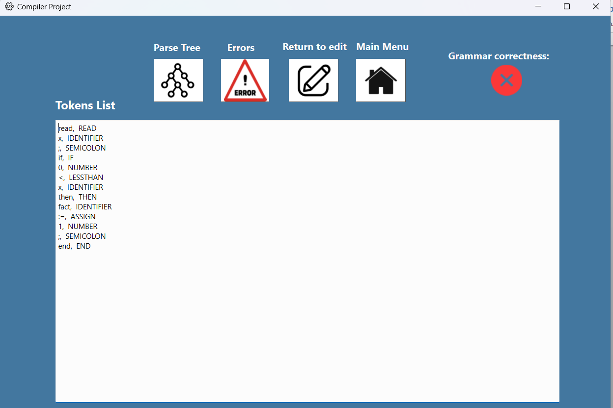
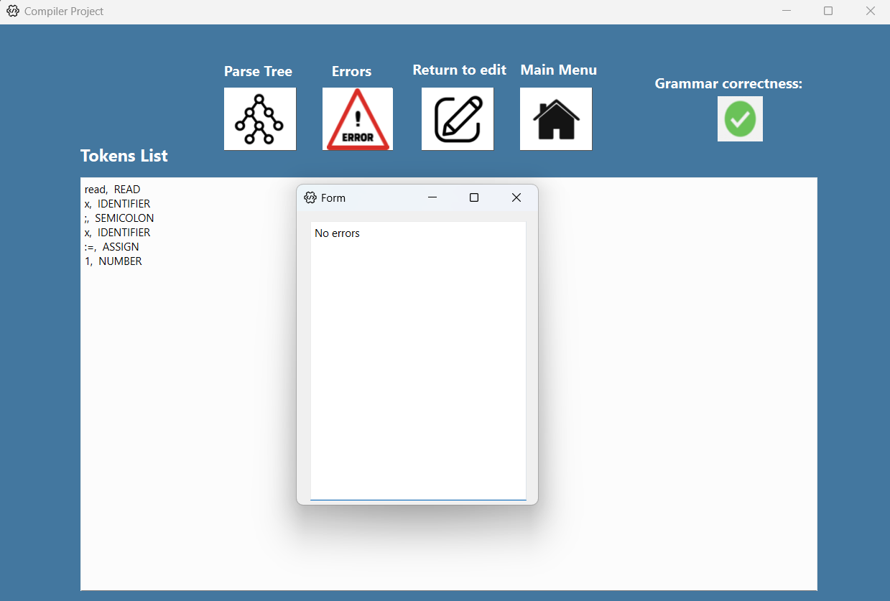
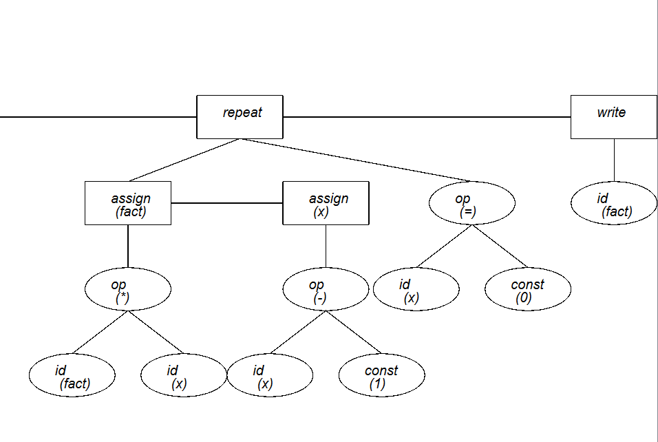
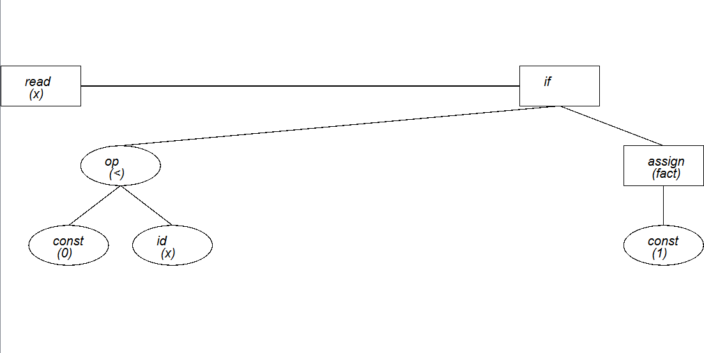

# Tiny-Compiler #

## **Table Of Contents**
- [Description](#description)
- [Screenshots](#screenshots)
- [Contributing](#contribution)
- [Contact](#contact)

## **Description**
The “Tiny” compiler written in C++ and using Qt framework. The compiler 
can take (either a tiny source code written in *.tiny file or tiny tokens
written in *.token file). The input file is (either by opening an existing file 
or by creating a newer one). The compiler performs lexical analysis 
(scanning) and syntactic analysis (parsing) to generate a syntax tree. The 
syntax tree represents the structure and meaning of the source code. The 
syntax tree sets all statements inside rectangles, all expressions and the 
unexpected values inside ellipses. The compiler can detect the errors in 
scanning process. Also we can compiler more than one source code 
without closing and reopening the compiler. 

## **Screenshots**

     
     
         
         
         
         
         

## **Contribution**
 
Thank you for considering contributing to this project! Please read the **[Contributor Covenant](https://www.contributor-covenant.org/)** before submitting any contributions.

### **Types of Contributions**

We welcome contributions in the form of bug reports, feature requests, code contributions, and documentation improvements.

### **How to Contribute**

1. Fork the repository and create a new branch.
2. Make your changes and ensure that they are well-documented and tested.
3. Submit a pull request to the main repository and include a detailed description of your changes.

### **Code of Conduct**

We expect all contributors to adhere to the **[Contributor Covenant](https://www.contributor-covenant.org/)**. Please be respectful and inclusive in your contributions and interactions with others.

## Contact

Feel free to reach out to us on any of the following emails:

- zeyadmohamedasu@gmail.com
- bishoyyosry@gmail.com